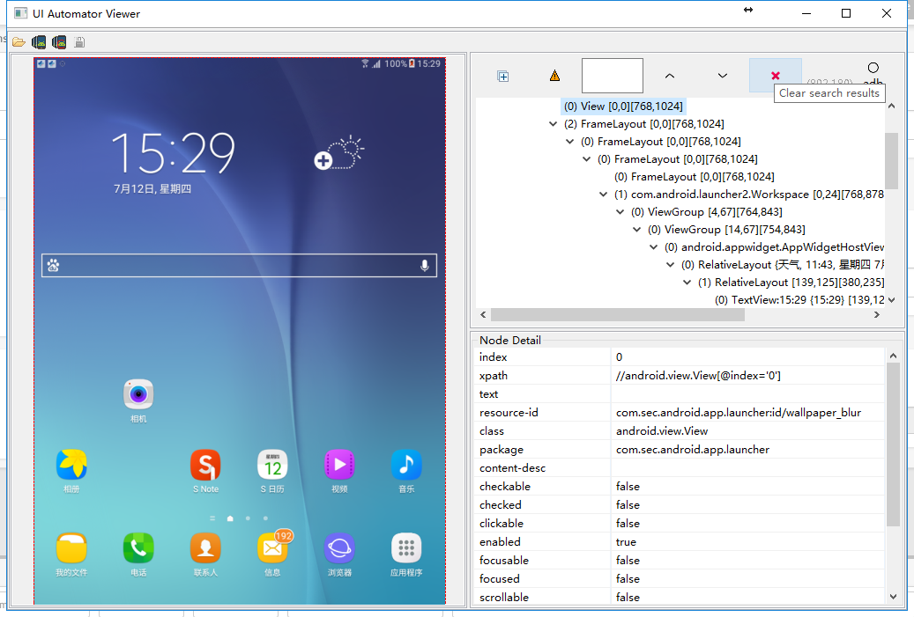

UIautomatorvViewer
===

为什么又重新开一个UIautomatorvViewer的项目？
1. 目前社区或能查到修改版本和开放源码的版本的基本都是基于4.4之前的版本，目前Android已经9.x了。
2. 编写一个易于大家修改构建的版本，目前只需按照下面说明，直接可以从官网选择自己喜欢的版本构建。



##### 使用方式：
方式1.直接下载根目录下的uiautomatorviewer.jar,替换你本地的${ANDROID_HOME}/tools/lib下的uiautomatorviewer.jar即可

方式2.执行gradle jar命令(或gradlew jar)，编译工程，将build目录下编译出来的uiautomatorviewer.jar替换你本地的${ANDROID_HOME}/tools/lib下的uiautomatorviewer.jar即可

#### 目前默认使用adb截图和dump xml

adb截图使用的是[LvmamaXmlKit](https://testerhome.com/topics/12459),所以使用此功能需要把这个#jar 导入到手机中#，命令如下：
```
//复制LvmamaXmlKit.jar到本地D盘根目录下
adb push D:\LvmamaXmlKit.jar /data/local/tmp/
```

##### 背景：
在做UI自动化时必不可少需要使用到uiautomatorviewer这个工具，但是有时候我们进行元素定位的时候希望使用xpath定位，而这个 工具自身并没提供，为了方便自动生成xpath。在网上找到的方法感觉不是很完整，于是打算自己亲自对该工具进行二次开发。
- 开发环境：
    - ide:intellij idea
    - 编译环境：gradle
    - 语言环境：java
    - 还要必不可少的android sdk
    
    
##### 下载源码
- 下载[marshmallow uiautomatorviewer源代码](https://android.googlesource.com/platform/tools/swt/+/marshmallow-mr3-release/uiautomatorviewer/)，不同版本的代码可以自己切换分支下载。
- 依赖`jar`可以右键以`zip`形式打开`uiautomatorviewer.jar`在 `META-INF\MANIFEST.MF`找到，如下：
```
Manifest-Version: 1.0
Class-Path:  org-eclipse-jface-3.6.2.jar ddmlib.jar org-eclipse-core-c
 ommands-3.6.0.jar org-eclipse-equinox-common-3.6.0.jar osgi-4.0.0.jar
  common.jar kxml2-2.3.0.jar annotations.jar guava-18.0.jar
Main-Class: com.android.uiautomator.UiAutomatorViewer
```
这些jar可以到你本地的${ANDROID_HOME}/tools/lib中找到

希望添加的功能列表:

* [x] 添加xpath
* [x] 增加adb截图
* [ ] 添加ios版本支持
* [ ] 添加appium脚本代码
* [ ] 等等

感谢
---
[yangzaiCN/uiautomatorviewer](https://github.com/yangzaiCN/uiautomatorviewer)